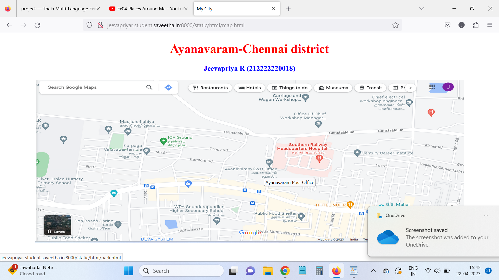
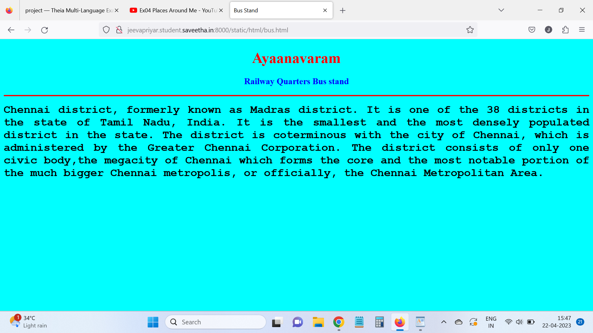
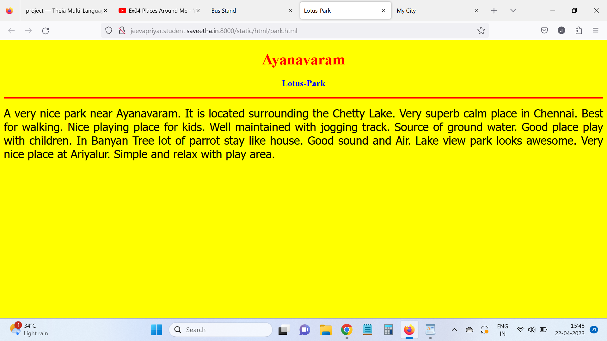
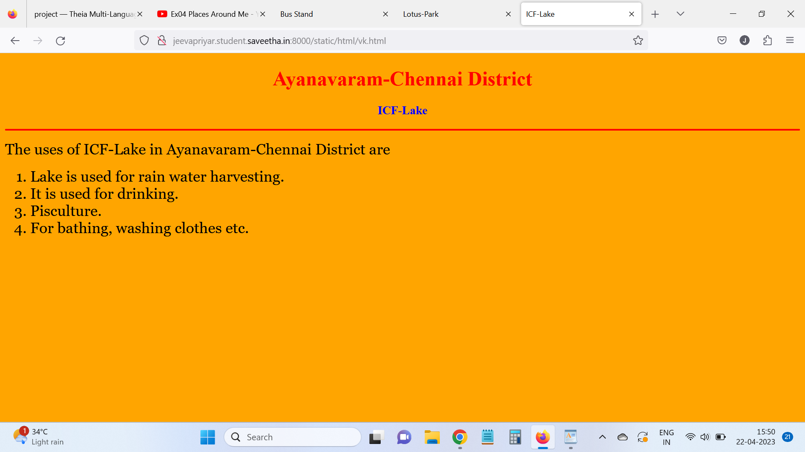
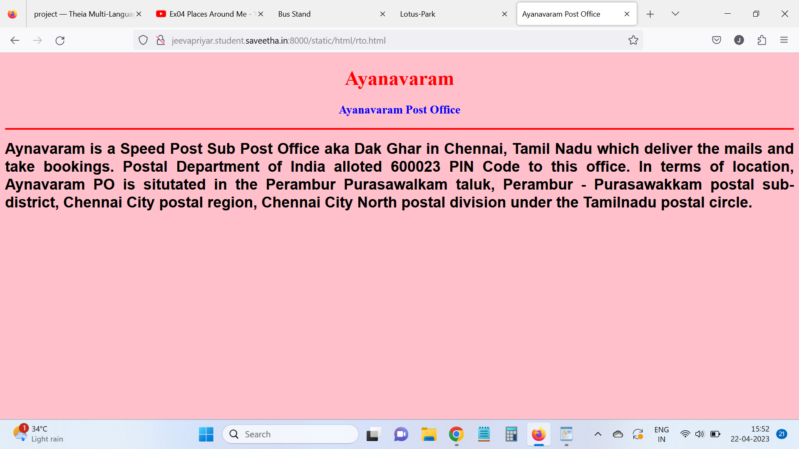
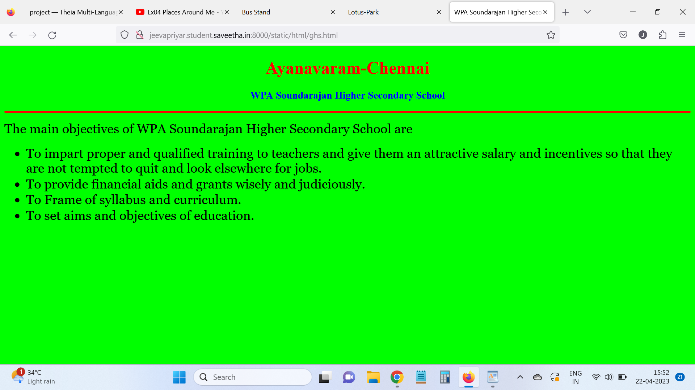
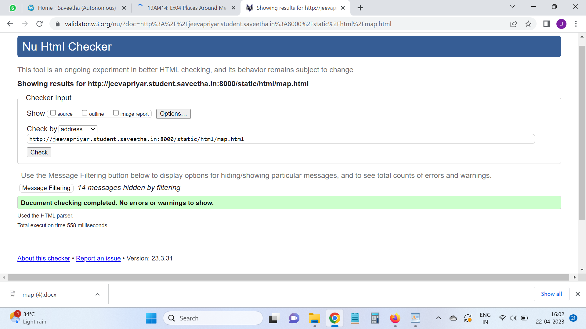

# Places Around Me
## AIM:
To develop a website to display details about the places around my house.

## Design Steps:

### Step 1:
Clone the github repository into Theia IDE.
### Step 2:
Create  a new Django project.

### Step 3:
Write the needed html code

### Step 4:
Run the Django server and execute the HTML files.

## Code:
```
map.html
<!DOCTYPE html>
<html lang="en">
<head>
<title>My City</title>
</head>
<body>
<h1 align="center">
<font color="red"><b>Ayanavaram-Chennai district</b></font>
</h1>
<h3 align="center">
<font color="blue"><b>Jeevapriya R (212222220018)</b></font>
</h3>
<center>

<map name="MyCity">
<area shape="circle" coords="190,50,20" href="/static/html/vk.html" title="ICF-Lake">
<area shape="rectangle" coords="230,30,260,60" href="/static/html/park.html" title="Lotus-Park">
<area shape="circle" coords="400,350,50" href="/static/html/ghs.html" title="WPA Sundarajan Higher Secondary School">
<area shape="circle" coords="400,200,75" href="/static/html/bus.html" title="Railway Quarters Bus Stand">
<area shape="rectangle" coords="490,150,870,320" href="/static/html/rto.html" title="Ayanavaram Post Office">
</map>
</center>
</body>
</html>

bus.html
<!DOCTYPE html>
<html lang="en">
<head>
<title>Bus Stand</title>
</head>
<body bgcolor="cyan">
<h1 align="center">
<font color="red"><b>Ayaanavaram</b></font>
</h1>
<h3 align="center">
<font color="blue"><b>Railway Quarters Bus stand</b></font>
</h3>
<hr size="3" color="red">
<p align="justify">
<font face="Courier New" size="5">
<b>
Chennai district, formerly known as Madras district.
It is one of the 38 districts in the state of Tamil Nadu, India. 
It is the smallest and the most densely populated district in the state. 
The district is coterminous with the city of Chennai, which is administered by the Greater Chennai Corporation.
The district consists of only one civic body,the megacity of Chennai which forms the core and the most notable portion of the much bigger Chennai metropolis, or officially, the Chennai Metropolitan Area.
</b>
</font>
</p>
</body>
</html>

park.html
<!DOCTYPE html>
<html lang="en">
<head>
<title>Lotus-Park</title>
</head>
<body bgcolor="yellow">
<h1 align="center">
<font color="red"><b>Ayanavaram</b></font>
</h1>
<h3 align="center">
<font color="blue"><b>Lotus-Park</b></font>
</h3>
<hr size="3" color="red">
<p align="justify">
<font face="Tahoma" size="5">
A very nice park near Ayanavaram. It is located surrounding the Chetty Lake. 
Very superb calm place in Chennai. Best for walking. Nice playing place for kids.
Well maintained with jogging track. Source of ground water.
Good place play with children.  In Banyan Tree lot of parrot stay like house. 
Good sound and Air. Lake view park looks awesome.
Very nice place at Ariyalur.
Simple and relax with play area.
</font>
</p>
</body>
</html>

rto.html
<!DOCTYPE html>
<html lang="en">
<head>
<title>Ayanavaram Post Office</title>
</head>
<body bgcolor="pink">
<h1 align="center">
<font color="red"><b>Ayanavaram</b></font>
</h1>
<h3 align="center">
<font color="blue"><b>Ayanavaram Post Office</b></font>
</h3>
<hr size="3" color="red">
<p align="justify">
<font face="Arial" size="5">
<b>
Aynavaram is a Speed Post Sub Post Office aka Dak Ghar in Chennai, Tamil Nadu which deliver the mails and take bookings. 
Postal Department of India alloted 600023 PIN Code to this office. 
In terms of location, Aynavaram PO is situtated in the Perambur Purasawalkam taluk, Perambur - Purasawakkam postal sub-district, Chennai City postal region, Chennai City North postal division under the Tamilnadu postal circle.
</b>
</font>
</p>
</body>
</html>

ghs.html
<!DOCTYPE html>
<html lang="en">
<head>
<title>WPA Soundarajan Higher Secondary School</title>
</head>
<body bgcolor="lime">
<h1 align="center">
<font color="red"><b>Ayanavaram-Chennai</b></font>
</h1>
<h3 align="center">
<font color="blue"><b>WPA Soundarajan Higher Secondary School</b></font>
</h3>
<hr size="3" color="red">
<p align="justify">
<font face="Georgia" size="5">
The main objectives of WPA Soundarajan Higher Secondary School are 
<ul>
<li>To impart proper and qualified training to teachers and give them an attractive salary and incentives so that they are not tempted to quit and look elsewhere for jobs.</li>
<li>To provide financial aids and grants wisely and judiciously.</li>
<li>To Frame of syllabus and curriculum.</li>
<li>To set aims and objectives of education.</li>
</ul>
</font>
</p>
</body>
</html>

vk.html
<!DOCTYPE html>
<html lang="en">
<head>
<title>ICF-Lake</title>
</head>
<body bgcolor="orange">
<h1 align="center">
<font color="red"><b>Ayanavaram-Chennai District</b></font>
</h1>
<h3 align="center">
<font color="blue"><b>ICF-Lake</b></font>
</h3>
<hr size="3" color="red">
<p align="justify">
<font face="Georgia" size="5">
The uses of ICF-Lake in Ayanavaram-Chennai District are 
<ol type="1">
<li>Lake is used for rain water harvesting.</li>
<li>It is used for drinking.</li>
<li>Pisculture.</li>
<li>For bathing, washing clothes etc.</li>
</ol>
</font>
</p>
</body>
</html>

```


## Output:







## HTML VALIDATOR


## Result:
The program for implementing image map is executed successfully.